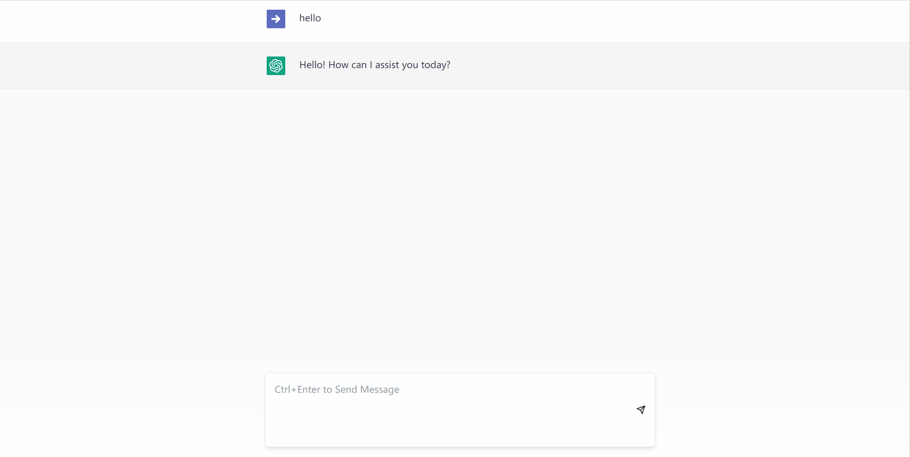

**For personal study only, do not use for commercial purposes**.

It is a pure frontend project with **NO BACKEND** . Technically you can fork this project and set it up with deploy tools to host your own website directly.

So far it is a **useable demo** , which hasn't been complete yet. To test it locally, add a .env file and set the environment variable `VITE_AI_TOKEN` as your OpenAI API key (start with `sk-`).

