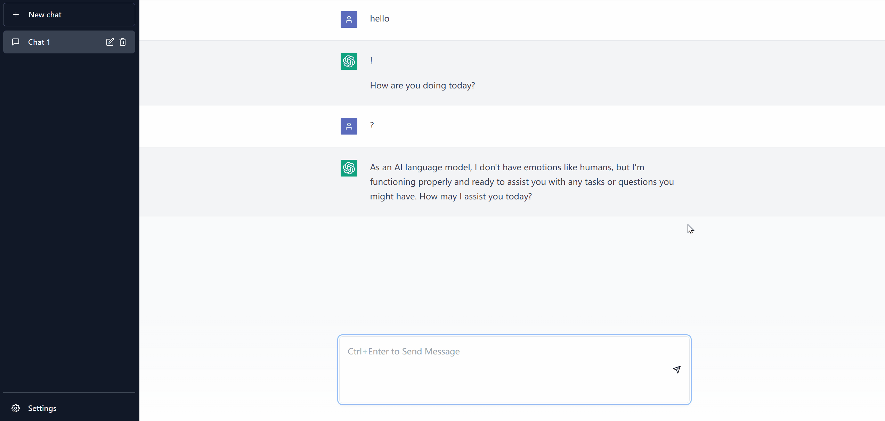

# ChatGPT Frontend

For personal study only, do not use for commercial purposes.



This project is modeled on the original ChatGPT website and aim to provide services as similar as possible. It supports:

- Identical visual design

- Stream HTTP responses
- Full markdown support: math formula, code highlighting, tables, etc.
- Custom GPT model settings


The website is build with Vite + React.  No backend needed. To test it locally, run:

```
npm install
npm run dev
```